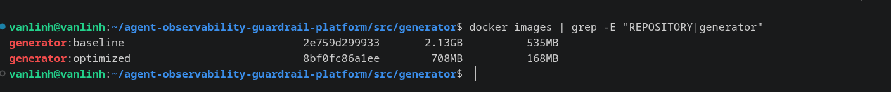
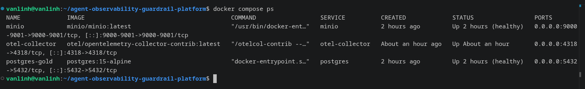
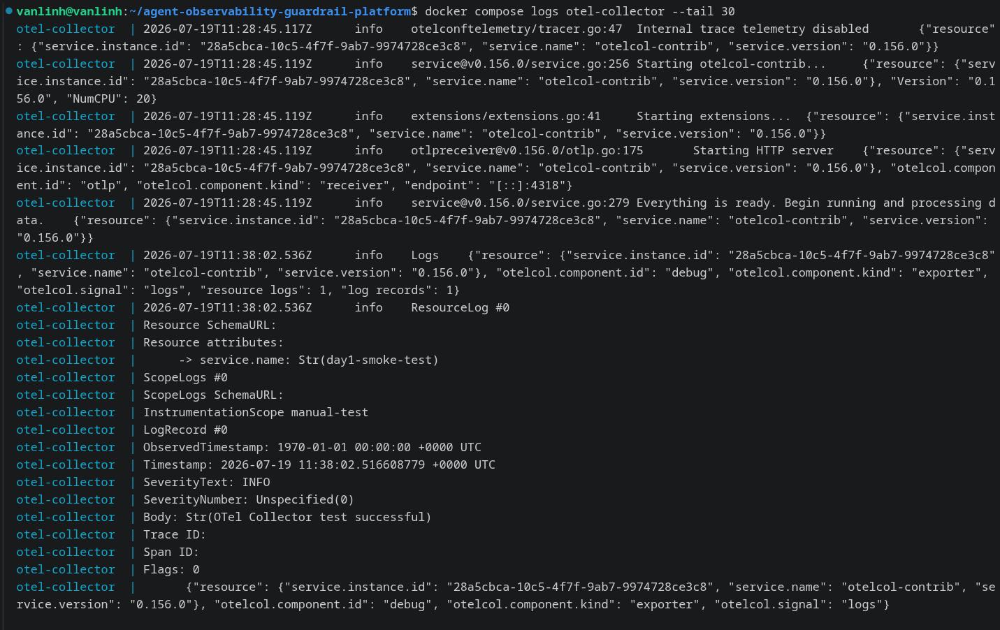

# Docker Image Optimization

## Method
- **Baseline** (`Dockerfile.baseline`): single stage, based on `python:3.11`
  (full image), installs dependencies and copies code in the same layer.
- **Optimized** (`Dockerfile`): two stages — `builder` (`python:3.11-slim`,
  used only to `pip install --user`) → `runtime` (a fresh `python:3.11-slim`,
  copies only `/root/.local` from `builder`, without pip cache or build
  artifacts). The runtime image also sets `PYTHONDONTWRITEBYTECODE=1`
  (no `__pycache__/` generated) and `PYTHONUNBUFFERED=1` (real-time,
  unbuffered logs).

## Evidence

Readers should look at the `SIZE` column for the `generator:baseline` and
`generator:optimized` rows.

## Before/After Results
| | Size |
|---|---|
| Baseline (`python:3.11`, single-stage) | 511 MiB |
| Optimized (multi-stage, `python:3.11-slim`) | 160 MiB |
| Reduction | ~68.7% (351 MiB saved) |

## Conclusion
The multi-stage build reduces image size because the final `runtime` stage no
longer carries the pip cache, build tools, or intermediate files generated
while installing dependencies in the `builder` stage — it only keeps the
installed Python packages (`/root/.local`) and the code needed to run. Using
`python:3.11-slim` (instead of the full `python:3.11` image) as the base also
removes many system tools not needed at runtime.

## Infrastructure Health Check

`minio` and `postgres-gold` are in `healthy` state; `otel-collector` is in
`Up` state (no healthcheck configured on Day 1) with no configuration errors
in the logs.