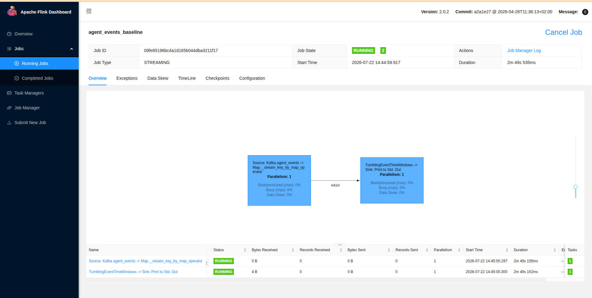
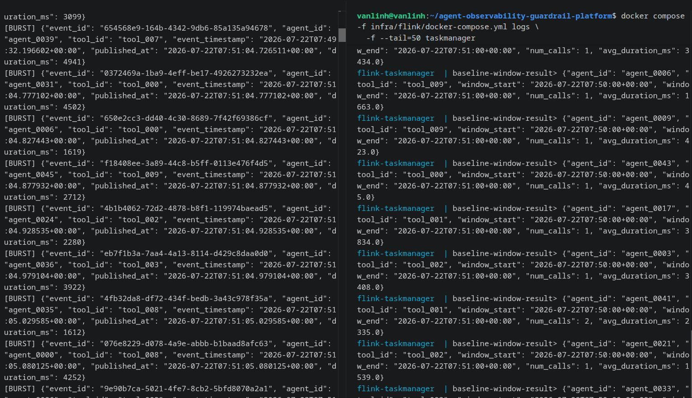
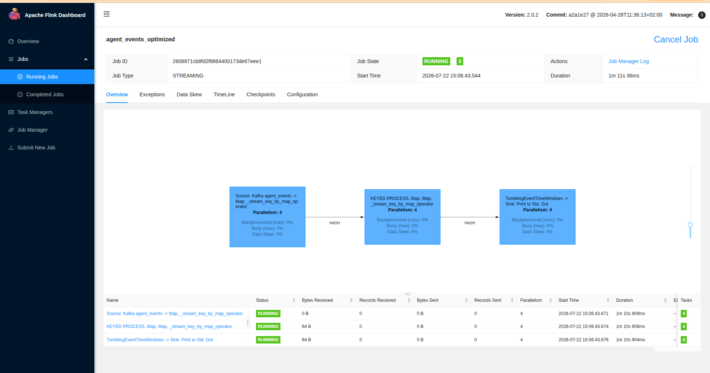
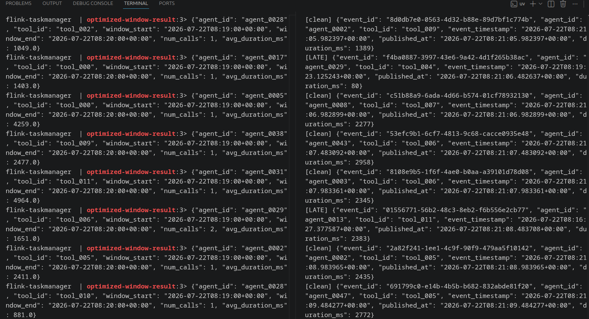

# Flink Stream Processing Optimization

## Deployment
Flink runs as a real Standalone cluster (`infra/flink/docker-compose.yml`):
one `jobmanager` and one `taskmanager`, both built from a custom image
(`infra/flink/Dockerfile`, based on `flink:2.0.2-scala_2.12-java17`
with Python and `apache-flink==2.0.0` installed, since the official
Flink image does not include Python by default). The Kafka connector
JAR is mounted directly into `/opt/flink/lib/`, where Flink auto-loads
it onto the classpath, so the job code does not call `add_jars()` or
configure a local execution environment. Jobs are submitted via
`docker compose exec jobmanager flink run -py /opt/flink/usrlib/<script>.py -d`.
Inside the cluster, Kafka is reached via the internal listener
(`kafka:19092`); the generator, running on the host, uses the
externally published listener (`localhost:9092`).

## Baseline
`flink_baseline.py` runs with `parallelism=1` and a 1-second watermark
tolerance — far tighter than the generator's late delays (up to 300s) —
so late events falling outside that tolerance are dropped from their
window. No deduplication is applied, so duplicate events inflate
`num_calls`.

Note: the Flink UI's "Records Received" column can show 0 for the
`KafkaSource` operator even while the job is actively processing data
and printing real results — a known metric-reporting quirk with this
connector, not a sign the job is idle. The Stdout evidence above
confirms real records are flowing through the pipeline.

## Burst
Parallelism is raised from 1 to 4 for the optimized job, spreading the
traffic spike across more task slots instead of queuing behind a
single thread. The optimized job's task graph shows 4 parallel
instances of every operator instead of 1.

## Late Arrival
The watermark tolerance is widened to 10 seconds, and `.with_idleness()`
prevents the watermark from stalling if a Kafka partition briefly has
no traffic. An explicit `allowed_lateness` of 5 minutes keeps the
window open and re-emits an updated result if a late event arrives
after the window would otherwise have closed — matching the
generator's maximum configured delay (up to 300 seconds). Events later
than that grace period still fall back to Flink's default behavior of
being dropped, rather than being routed to a separate side output.

## Duplicate
A keyed `ValueState`, scoped per `event_id` and bounded by a 10-minute
TTL, remembers which events have already been seen and drops repeats
within that window without holding state indefinitely.

## Window Processing
Both jobs use the same 1-minute tumbling event-time window, keyed by
`(agent_id, tool_id)`. The optimized job aggregates all elements
collected for a window inside `WindowAggregationFunction`, computing
`num_calls` and `avg_duration_ms` once the window fires.

## Proof it worked

The optimized job's task graph confirms parallelism 4 across all three
operators (source, deduplication, windowed aggregation). Running it
against the same generator traffic as the baseline produced windowed
aggregates without the duplicate inflation seen in the baseline, and
some window results reflect late-arriving events being correctly
incorporated before the window closed, instead of being dropped
outright as in the baseline.
