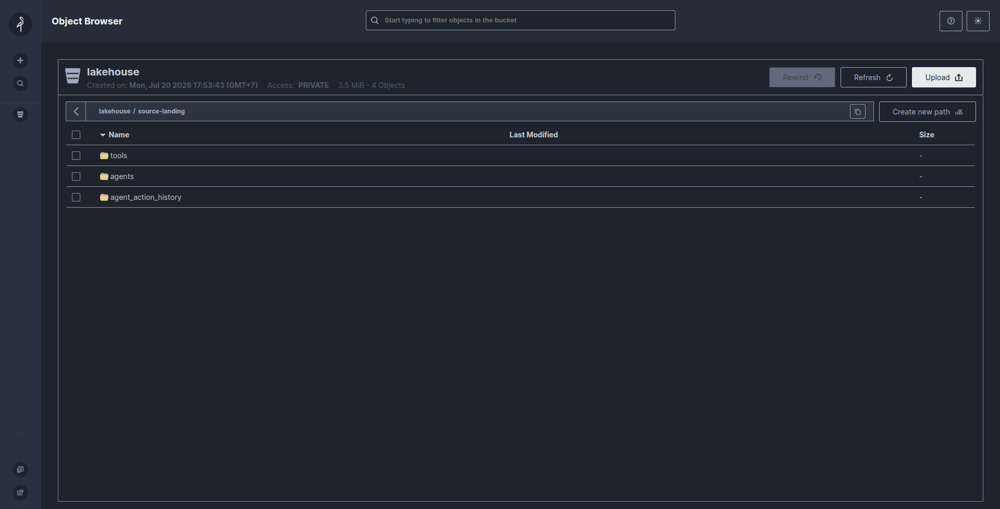
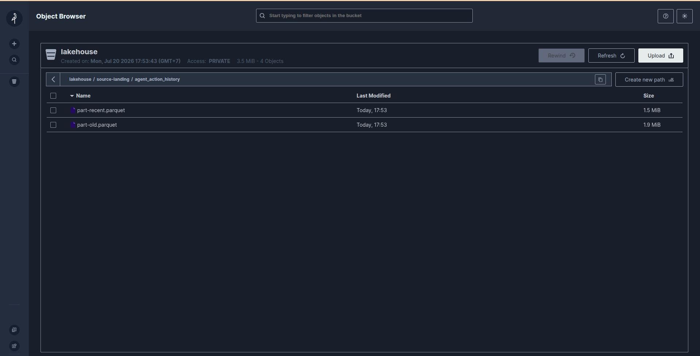
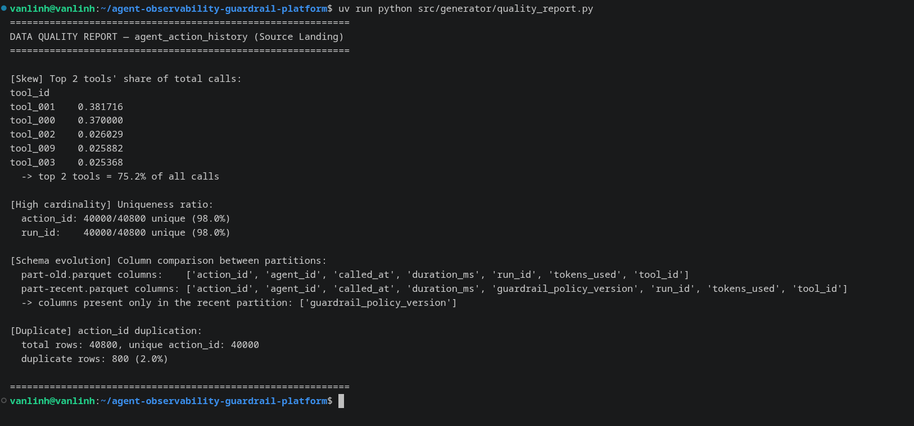

# Offline Data Quality

## Method
`src/generator/offline_generator.py` generates three synthetic datasets and
writes them as Parquet to MinIO Source Landing, driven entirely by
`config.yaml`. `agent_action_history` intentionally contains four
controlled data-quality issues, verified afterward by
`src/generator/quality_report.py`, which downloads the files back from
MinIO and recomputes the metrics.

## Evidence

## Issues and Results

### Skew
The top 2 tools receive a fixed share of calls (configured at 75% in
`config.yaml`). Measured result: **top 2 tools = 75.2% of all calls**
(`tool_001` at 38.2%, `tool_000` at 37.0%), matching the configured target.

### High Cardinality
`action_id` and `run_id` are UUID4 values, so both are effectively unique
relative to the total row count. Measured result: **40,000 / 40,800 unique
(98.0%)** for both columns — the 2.0% non-unique portion is exactly the
duplicate rows described below, confirming the dataset has no accidental
collisions.

### Schema Evolution
Rows older than 40 days are written to `part-old.parquet` without the
`guardrail_policy_version` column; rows from the last 40 days are written
to `part-recent.parquet` with that column present. This is a genuine
file-level schema difference, not just null values — `part-old.parquet`
has 7 columns, `part-recent.parquet` has 8, with `guardrail_policy_version`
present only in the recent file. Downstream readers (Apache Spark)
must use schema merging to read both files together.

### Duplicate
2% of rows are re-inserted with an identical `action_id` after the base
dataset is generated. Measured result: **800 duplicate rows out of 40,800
total (2.0%)**, matching the configured `duplicate_rate`.

## Conclusion
All four data-quality issues required are present in the
generated `agent_action_history` dataset and confirmed by re-reading the
data back from MinIO, not just from the in-memory generation step.