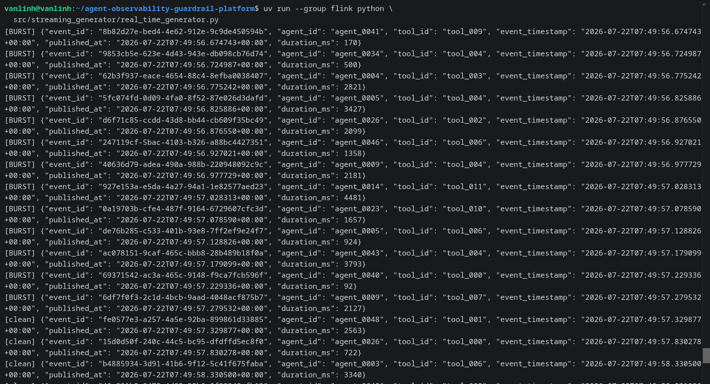

# Streaming Data Quality

## Method
`src/streaming_generator/real_time_generator.py` publishes a continuous
stream of `agent_events` records to Kafka, driven by `config.yaml`.
Three problems are intentionally seeded, each independently
parameterized: burst (a short high-rate spike every N seconds), late
arrival (a fraction of events carry a backdated `event_timestamp`), and
duplicate (a fraction of events are re-published with the same
`event_id`).

## Evidence

The output shows all three labels appearing in the stream:
`[BURST]` during the configured high-rate spike, `[clean]` for normal
events, and `[LATE]` for events whose `event_timestamp` is backdated
relative to `published_at`.

## Conclusion
All three streaming data-quality problems are present in the generated
`agent_events` stream, each independently configurable via
`config.yaml`.
