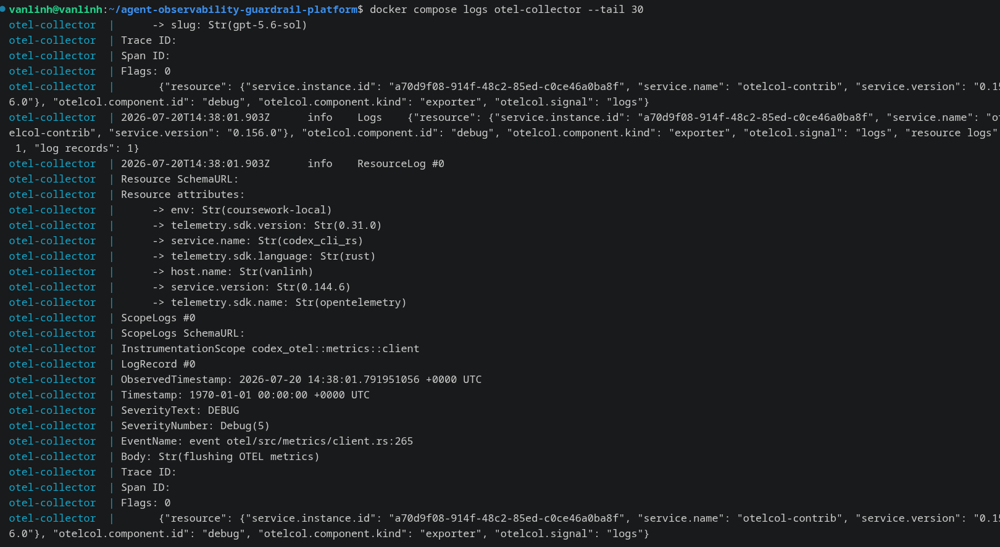
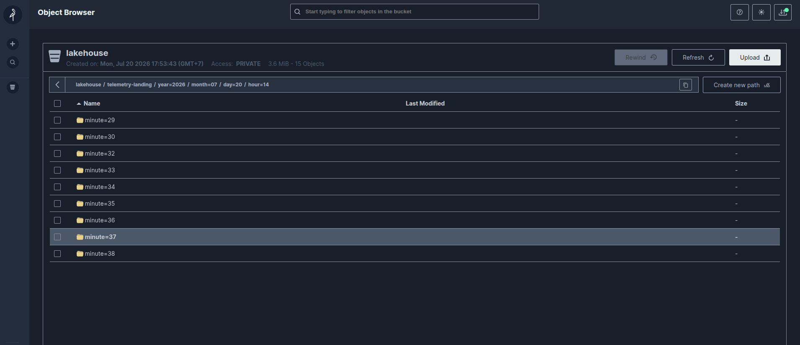

# Novel Idea 1 — Interactive Telemetry Path via OpenTelemetry

## Idea
OpenTelemetry and the OpenTelemetry Collector are not covered in the EDAI
curriculum, which satisfies the rubric's Novel Idea condition.
This path captures real telemetry generated while Codex is used to work on
this project, rather than synthetic telemetry produced by a data generator.
The records are persisted in the same MinIO lakehouse used by the rest of
the platform, under a dedicated `telemetry-landing` prefix.
The telemetry came from real interactive Codex sessions, while
`log_user_prompt = false` prevented the prompt text itself from being
exported — the export proves a real agent session occurred without
capturing what was actually asked.

## How it works
1. Codex is configured in the global, user-level file
   `~/.codex/config.toml` to export OTLP/HTTP logs to
   `http://127.0.0.1:4318/v1/logs` when run in interactive CLI mode.
   The interactive CLI was the validated telemetry source for this
   coursework, not the VS Code sidebar/MCP mode.
2. The OpenTelemetry Collector is configured in
   `infra/otel/collector-config.yaml` and runs from the pinned image
   `otel/opentelemetry-collector-contrib:0.156.0`.
   It receives OTLP over HTTP and sends every log record to two exporters:
   - `debug`, which writes detailed records to the Collector console for
     quick manual verification;
   - `awss3`, an exporter currently marked as alpha, which persists
     records to the MinIO bucket `lakehouse` under the `telemetry-landing`
     prefix.
3. The `awss3` exporter uses `marshaler: otlp_json`. Each uploaded object is
   therefore a single OTLP JSON object, not a JSON Lines file. This was
   confirmed by downloading and inspecting an object stored in MinIO.
   Objects are partitioned by UTC time using a hierarchy similar to
   `year=YYYY/month=MM/day=DD/hour=HH/minute=mm`.
4. On Day 4, the Source Ingestion Adapter will read this telemetry and
   canonicalize it into Bronze Raw Data alongside the synthetic datasets
   generated on Day 2.

## Proof it worked

Running Codex in interactive CLI mode from this project's repository
produced real OTLP log records with the following resource attributes:

- `service.name = codex_cli_rs`
- `service.version = 0.144.6`

The records were visible in the OpenTelemetry Collector's debug output and
were also persisted as OTLP JSON objects under
`lakehouse/telemetry-landing/` in MinIO.

Objects were present across multiple UTC time partitions, from
`year=2026/month=07/day=20/hour=14/minute=29` through `minute=38`,
confirming that the export occurred repeatedly during the test window,
rather than as a single one-off event.