# Airflow Pipelines

## Deployment

Airflow `3.0.0` with `LocalExecutor` is deployed through:

```text
infra/airflow/docker-compose.yml
```

The Airflow stack is separate from the root Compose stack but joins the
shared external network:

```text
data-stack-network
```

This allows Airflow tasks to reach MinIO and the PostgreSQL Gold
Warehouse through Docker service names.

Airflow uses its own metadata database:

```text
postgres-airflow
```

This database is independent from:

```text
postgres-gold
```

which stores the dimensional Gold Warehouse and the offline feature
table.

Airflow 3 separates DAG parsing into the dedicated
`airflow-dag-processor` service and exposes its UI and API through
`airflow-api-server`.

The following setting must point to the API server's Docker service
name:

```text
AIRFLOW__CORE__EXECUTION_API_SERVER_URL
```

Without the correct execution API URL, the Airflow UI may load and DAGs
may trigger, while task execution still fails.

The following secret must also be configured consistently across all
Airflow components:

```text
AIRFLOW__API_AUTH__JWT_SECRET
```

Airflow components use this shared secret to authenticate internal task
execution requests. If each process generates its own secret, task
requests are rejected even though the DAG parses correctly.

No `airflow-triggerer` service is included because the current pipelines
use regular TaskFlow tasks and do not use deferrable operators.

Fernet encryption is intentionally disabled:

```text
AIRFLOW__CORE__FERNET_KEY: ""
```

This is acceptable for the local project environment. The Fernet key
encrypts stored connection values and is unrelated to the JWT secret
used for communication between Airflow components.

The custom Airflow image is defined in:

```text
infra/airflow/Dockerfile
```

It is based on:

```text
apache/airflow:3.0.0-python3.11
```

The Dockerfile explicitly installs:

- Java 17 for Spark Local execution.
- PySpark `3.5.0`.
- `apache-airflow-providers-fab` for Airflow CLI user management.
- `boto3` for MinIO access.
- `pandas` and `pyarrow` for Parquet processing.
- Great Expectations `0.18.19`.

PostgreSQL connectivity is available in the Airflow runtime through
`psycopg2` and the registered PostgreSQL connection type. This allows
`postgres_gold` to be resolved through `BaseHook` and used by DP2 and
DP3 without embedding database credentials in the DAG code.

Great Expectations is installed separately from the main Airflow
dependency block to avoid incompatible `ruamel.yaml` constraints.

## Airflow Connections

Connection configuration is managed centrally through Airflow
Connections instead of raw credential environment variables inside DAG
tasks.

The `airflow-init` service creates the following reusable connections:

| Connection ID | Connection type | Purpose | Used by |
|---|---|---|---|
| `minio_default` | Generic | Connects to MinIO at `http://minio:9000` | DP1 and DP2 |
| `postgres_gold` | PostgreSQL | Connects to the PostgreSQL Gold Warehouse | DP2 and DP3 |

The connections are created automatically when `airflow-init` runs.

Each connection is deleted and re-created on every `airflow-init` run.
When the stack is started with `--env-file .env`, the stored credentials
are refreshed from the current environment instead of retaining stale
values from an earlier run.

DP1 and DP2 use:

```text
minio_default
```

to obtain the MinIO endpoint, access key, and secret key.

DP2 and DP3 use:

```text
postgres_gold
```

to obtain the PostgreSQL host, port, database name, username, and
password.

The DAG code resolves connections through:

```python
from airflow.hooks.base import BaseHook

conn = BaseHook.get_connection("connection_id")
```

This design keeps credentials outside the pipeline logic and allows the
same connection definitions to be reused across multiple DAGs.

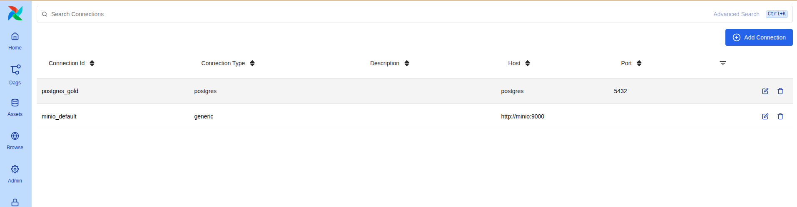

## DP1 — Bronze Ingestion

The `dp1_bronze_ingest` DAG copies Parquet files from MinIO Source
Landing into Bronze Raw Data and validates the resulting datasets.

The DAG contains two ordered tasks:

```text
ingest_minio_to_bronze
          ↓
validate_bronze
```

### Task 1 — `ingest_minio_to_bronze`

The ingestion task copies:

```text
source-landing/agents/agents.parquet
source-landing/tools/tools.parquet
source-landing/agent_action_history/part-old.parquet
source-landing/agent_action_history/part-recent.parquet
```

into:

```text
bronze/raw_agents.parquet
bronze/raw_tools.parquet
bronze/raw_agent_actions_old.parquet
bronze/raw_agent_actions_recent.parquet
```

The old and recent action partitions remain separate so schema
evolution stays visible to downstream batch processing.

The boto3 client obtains MinIO credentials from the
`minio_default` Airflow Connection.

Path-style S3 addressing is enabled:

```python
Config(s3={"addressing_style": "path"})
```

This is required for reliable MinIO access through the internal Docker
network.

### Task 2 — `validate_bronze`

The validation task uses the Great Expectations
`ge.from_pandas()` fluent API.

The checks cover:

- Required columns.
- Minimum row counts.
- Non-null constraints.
- Unique dimension keys.
- Expected action duplicates at the Bronze layer.
- Old and recent partition schema differences.
- Presence of `guardrail_policy_version` in the recent partition.
- Absence of `guardrail_policy_version` in the old partition.

### Proof of Execution

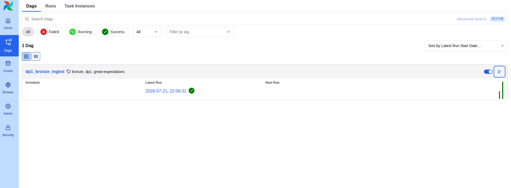

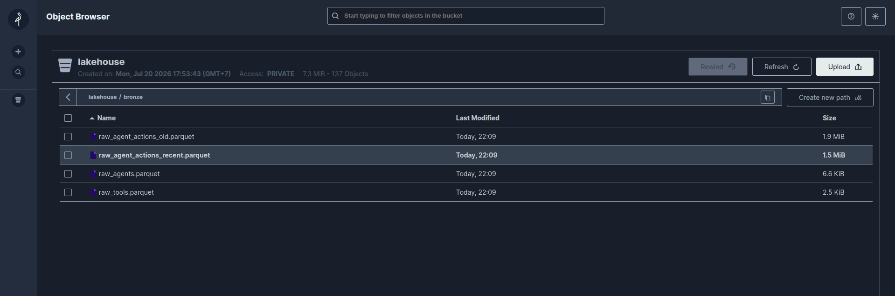

Triggering `dp1_bronze_ingest` from the Airflow UI completed both tasks
successfully and in the expected order.

The result confirms that Bronze Raw Data contains:

```text
raw_agents
raw_tools
raw_agent_actions_old
raw_agent_actions_recent
```

derived from Source Landing and validated with Great Expectations.

## DP2 — Silver and Gold Processing

The `dp2_silver_gold` DAG refreshes Silver Clean Data with Spark Local
and loads the dimensional Gold Model into PostgreSQL.

The DAG contains two ordered tasks:

```text
spark_bronze_to_silver_gold
              ↓
validate_silver_gold
```

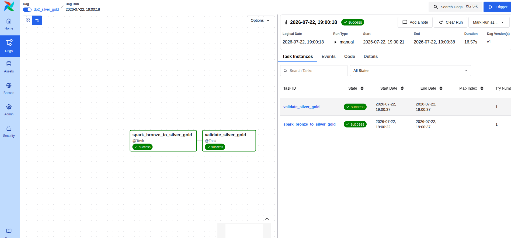

### Task 1 — `spark_bronze_to_silver_gold`

The first task invokes the optimized Spark batch job:

```text
src/batch_processing/batch_optimized.py
```

Inside the Airflow container, Spark runs in local mode:

```python
.master("local[*]")
```

The Spark stage performs the following transformations:

- Reads the old and recent Bronze action partitions.
- Uses `mergeSchema` to combine their schemas.
- Deduplicates actions by `action_id` with a window operation.
- Applies deterministic manual salting to the skewed `tool_id`
  aggregation.
- Uses `bucketBy(8, "action_id")` instead of creating
  high-cardinality partition directories.
- Writes Silver agents, tools, and actions to MinIO.

The Spark result was:

```text
Input action rows:                   40,800
Rows after action_id deduplication:  40,000
Silver action data files:                 8
Silver action rows:                  40,000
```

After Spark completes, the task reads:

```text
silver/stg_agents.parquet/
silver/stg_tools.parquet/
silver/stg_agent_actions/
```

The MinIO client resolves its endpoint and credentials from:

```text
minio_default
```

The task then builds and loads:

```text
dim_agent
dim_tool
fact_agent_action
```

into the PostgreSQL Gold Warehouse.

The PostgreSQL connection is resolved from:

```text
postgres_gold
```

The DAG therefore does not depend on raw MinIO or PostgreSQL credential
environment variables.

### Point-in-Time SCD2 Resolution

Silver actions contain the business key:

```text
agent_id
```

while `fact_agent_action` requires the historical SCD2 key:

```text
agent_key
```

Each action is matched to the agent version satisfying:

```text
valid_from_ts <= called_at < valid_to_ts
```

For the current version, a null `valid_to_ts` represents an open-ended
validity interval.

Because the generated action history and dimension history were created
independently, some historical actions occurred before the earliest
recorded SCD2 version of their agents.

DP2 backdates only the earliest SCD2 version of affected agents to the
first observed action timestamp.

This alignment is applied to the Gold dimension load only. Bronze and
Silver data remain unchanged.

### Derived Guardrail Violation Flag

The source action data does not contain a native guardrail violation
flag.

DP2 derives `is_violation` deterministically from `action_id`.

The implementation follows this rule:

```text
first 8 SHA-256 hexadecimal digits
              ↓
convert to integer
              ↓
value modulo 100 < 8
```

This produces an approximately eight-percent violation rate.

Unlike Python's built-in `hash()`, SHA-256 produces stable results
across processes and repeated DAG executions.

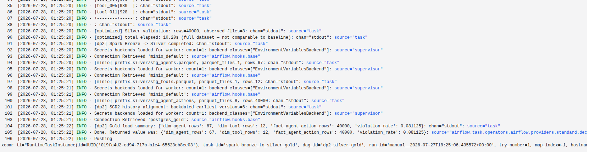

The Gold load result was:

| Gold table | Rows |
|---|---:|
| `dim_agent` | 67 |
| `dim_tool` | 12 |
| `fact_agent_action` | 40,000 |

The generated overall fact-level violation rate was approximately:

```text
8.11%
```

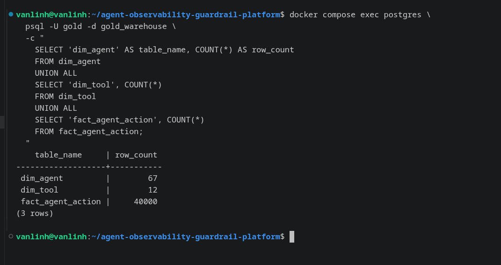

### Task 2 — `validate_silver_gold`

The validation task reads the Gold Warehouse through the same
`postgres_gold` Airflow Connection.

It checks that:

- Gold row counts match the load summary.
- `agent_key` contains no orphaned foreign-key references.
- `tool_id` contains no orphaned foreign-key references.
- Every action belongs to the validity interval of its assigned SCD2
  version.
- Every business `agent_id` has exactly one current SCD2 version.
- The generated violation rate remains within its expected range.

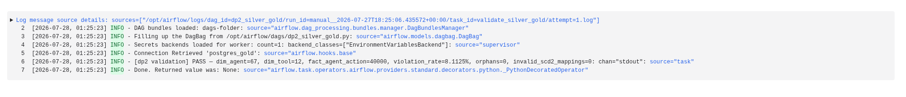

Validation result:

```text
[dp2 validation] PASS
dim_agent=67
dim_tool=12
fact_agent_action=40000
violation_rate=8.1125%
orphans=0
invalid_scd2_mappings=0
```

## DP3 — Offline Feature Materialization

The `dp3_offline_feature` DAG materializes and validates:

```text
feat_agent_guardrail_violation_rate_7d
```

The DAG contains two ordered tasks:

```text
compute_load_offline_feature
              ↓
validate_feature
```

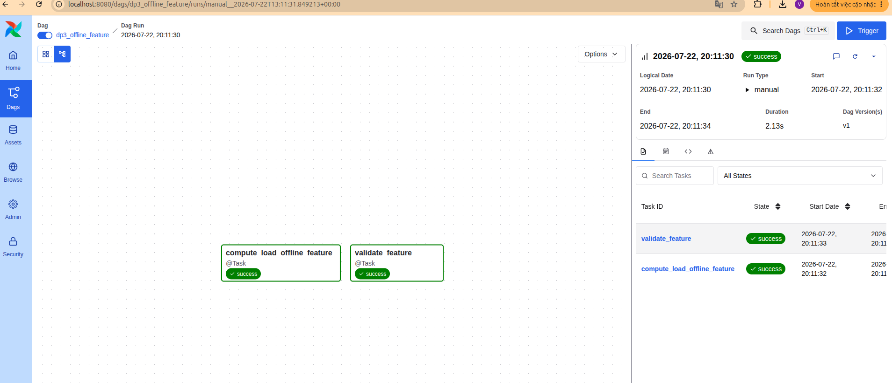

### Task 1 — `compute_load_offline_feature`

DP3 reads the PostgreSQL Gold tables instead of running Spark again:

```text
fact_agent_action
        +
dim_agent
        ↓
seven-day aggregation by agent_id
```

The task reuses the `postgres_gold` Airflow Connection already used by
DP2.

This keeps PostgreSQL connection configuration consistent between the
Gold-loading and feature-materialization pipelines.

The latest action timestamp in Gold is used as the reproducible
observation time:

```sql
MAX(fact_agent_action.called_at)
```

This timestamp becomes:

```text
event_timestamp
```

The feature window is:

```text
event_timestamp - 7 days
              →
event_timestamp
```

Anchoring the window to the latest dataset event rather than the current
server clock ensures that repeated executions over the same data produce
the same feature window.

For each `agent_id`, DP3 calculates:

```text
violation_rate_7d
=
violation_count / action_count
```

The materialized table contains:

```text
agent_id
violation_count
action_count
violation_rate_7d
event_timestamp
created
```

Where:

- `event_timestamp` is the feature observation time.
- `created` is the PostgreSQL load timestamp.

The compute result was:

```text
Feature rows:             50
Actions in 7-day window:  2,896
Violations in window:       203
```

The unweighted mean of the per-agent violation rates was approximately:

```text
6.96%
```

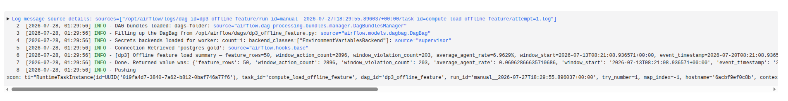

### Task 2 — `validate_feature`

The validation task also uses the `postgres_gold` Airflow Connection.

It checks that:

- One feature row exists for every agent represented in the source
  seven-day window.
- `agent_id` is unique.
- `event_timestamp` and `created` are not null.
- All rows share one snapshot `event_timestamp`.
- `action_count` is greater than zero.
- `violation_count` is between zero and `action_count`.
- `violation_rate_7d` is between zero and one.
- No duplicate feature rows exist.

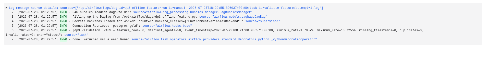

Validation result:

```text
[dp3 validation] PASS
feature_rows=50
distinct_agents=50
minimum_rate=1.7857%
maximum_rate=13.7255%
missing_timestamps=0
duplicates=0
invalid_rates=0
```

The minimum and maximum rates represent individual agent feature
values.

The compute-stage value of approximately `6.96%` is the unweighted mean
of all per-agent rates.

### Materialized Feature Sample

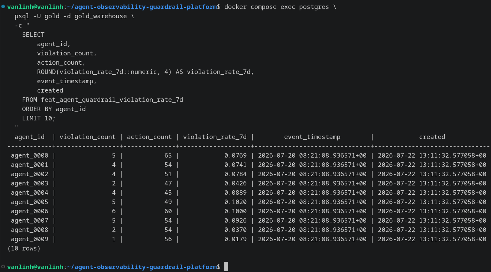

The sample confirms that the feature table contains:

- The business key `agent_id`.
- Violation and action counts.
- The seven-day violation rate.
- The feature observation timestamp.
- The warehouse creation timestamp.

The required time columns are:

```text
event_timestamp
created
```

## Pipeline Execution Order

The pipelines must be triggered in this order:

```text
dp1_bronze_ingest
        ↓
dp2_silver_gold
        ↓
dp3_offline_feature
```

DP2 depends on Bronze data produced by DP1.

DP3 depends on the Gold tables refreshed by DP2.

Running the DAGs in this order ensures that each downstream pipeline
uses the latest validated upstream data.

## Verification Summary

The Airflow deployment was verified through:

- Successful Airflow service startup.
- Successful DAG parsing.
- Reusable Airflow Connections.
- Successful DP1 ingestion and validation.
- Successful DP2 Spark processing and Gold loading.
- Successful DP2 Gold validation.
- Successful DP3 feature materialization.
- Successful DP3 feature validation.
- Persisted MinIO, PostgreSQL, and Airflow metadata volumes.

The migration to Airflow Connections changed only how credentials are
resolved. It did not change the pipeline transformations, row counts,
validation rules, or final outputs.
