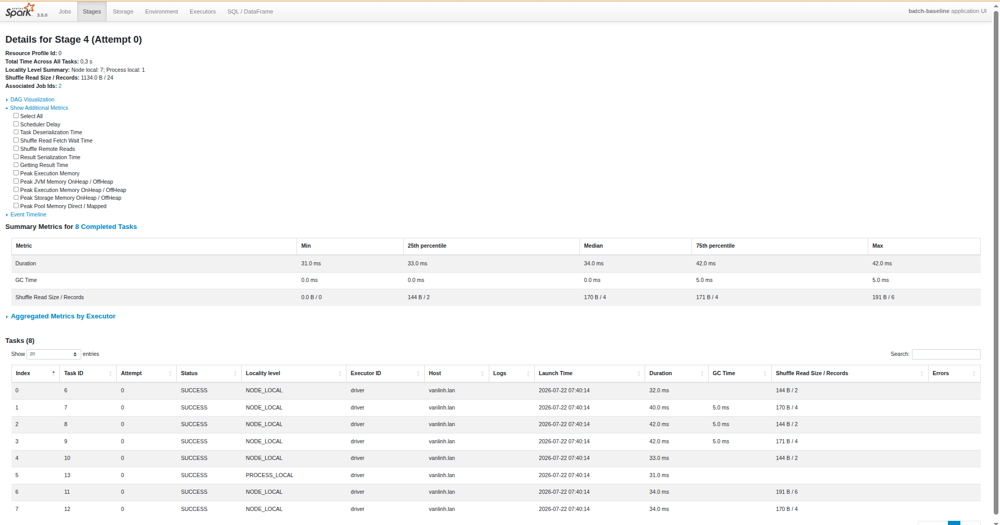
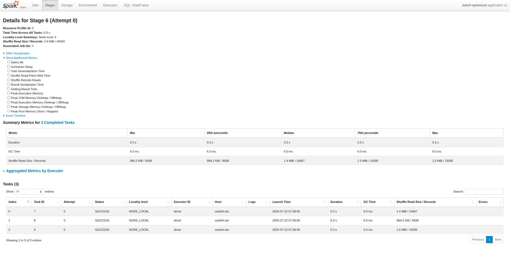
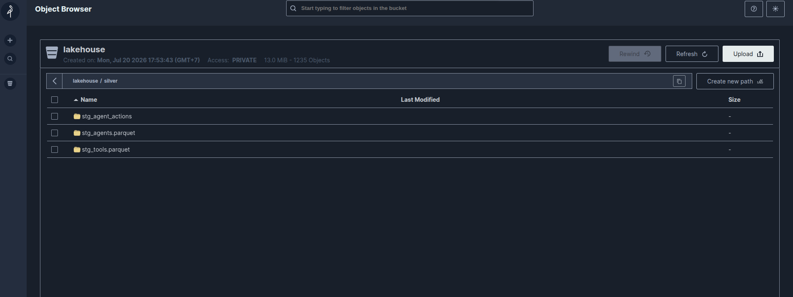

# Spark Batch Optimization

## Baseline

`batch_baseline.py` reads `raw_agent_actions_old` and
`raw_agent_actions_recent` without enabling `mergeSchema`, so the
inferred schema may omit `guardrail_policy_version`.

The job aggregates by `tool_id` without skew handling and writes a
1,000-row sample using `partitionBy("action_id")` to `benchmark/`.
This is a deliberate high-cardinality anti-pattern and is not real
Silver Clean Data.



Spark performs two-phase aggregation for
`groupBy("tool_id").count()`. Each input file first produces partial
counts for the 12 distinct tools, so the final aggregation reads only
24 intermediate records from two files. This is expected Spark
behavior, not an error.

The actual input skew is shown by the terminal output:

```text
[baseline] actions row count (with duplicates): 40800

+--------+-----+
|tool_id |count|
+--------+-----+
|tool_001|15574|
|tool_000|15096|
|tool_002| 1062|
|tool_009| 1056|
|tool_003| 1035|
|tool_006| 1023|
|tool_010| 1022|
|tool_007| 1018|
|tool_008| 1009|
|tool_004| 1003|
|tool_005|  965|
|tool_011|  937|
+--------+-----+
```

The two dominant tools contain:

```text
15,574 + 15,096 = 30,670 rows
30,670 / 40,800 ≈ 75.2%
```

Therefore, `tool_001` and `tool_000` account for approximately
**75.2%** of all input rows.

```text
[baseline] total elapsed: 42.07s
```

The baseline completed in **42.07 seconds**. Its
`partitionBy("action_id")` write creates roughly 1,000 small MinIO
objects from only 1,000 sampled rows because `action_id` is nearly
unique.

## Schema Evolution

The optimized job reads both action partitions with:

```python
.option("mergeSchema", "true")
```

This produces a unified schema containing
`guardrail_policy_version`. Older rows receive `null` for the evolved
column instead of losing it during schema inference.

## Duplicate Handling

Duplicates are removed with `row_number()` over a window partitioned by
`action_id` and ordered by `called_at` descending. Only the latest row
for each action is kept.

```text
[optimized] rows before dedup: 40800, after dedup: 40000
```

The job removed exactly **800 duplicate rows**, approximately **1.96%**
of the observed input and consistent with the configured 2% duplicate
rate.

The deduplicated DataFrame is persisted because it is reused by
multiple downstream operations.

## Skew Handling

Manual salting distributes each tool across eight intermediate buckets:

```python
F.pmod(F.xxhash64("action_id"), F.lit(8))
```

The job first aggregates by `(tool_id, salt)` and then sums the partial
results by `tool_id`. A deterministic hash ensures the same input
always receives the same salt.

```text
[optimized] per (tool_id, salt bucket) row counts:

+--------+-----+-----+
|tool_id |_salt|count|
+--------+-----+-----+
|tool_001|    1| 1972|
|tool_001|    3| 1952|
|tool_001|    4| 1949|
|tool_000|    4| 1916|
|tool_001|    0| 1889|
|tool_001|    7| 1885|
|tool_000|    1| 1883|
|tool_001|    5| 1881|
|tool_001|    2| 1868|
|tool_000|    7| 1859|
|tool_000|    2| 1853|
|tool_000|    3| 1850|
|tool_001|    6| 1849|
|tool_000|    6| 1840|
|tool_000|    5| 1824|
|tool_000|    0| 1790|
+--------+-----+-----+
```

Each dominant tool is spread across eight buckets containing roughly
**1,790–1,972 rows** each instead of remaining as one oversized
grouping key.



The optimized Spark UI shows:

```text
Shuffle Read Size / Records: 3.9 MiB / 40000
```

This confirms that the optimized pipeline executed a full-data shuffle
over the 40,000-row deduplicated dataset. The salt-bucket table is the
primary quantitative evidence that the skewed keys were balanced.

```text
[optimized] total elapsed: 8.71s
```

## High-Cardinality Optimization

The baseline uses:

```python
partitionBy("action_id")
```

Because `action_id` is nearly unique, this creates roughly one physical
partition per sampled action.

The optimized job instead uses:

```python
bucketBy(8, "action_id")
```

Bucketing limits the fact output to eight files:

```text
[optimized] Silver validation: rows=40000, observed_files=8
```

| Job | Output | Elapsed |
|---|---:|---:|
| Baseline | 1,000-row partitioned sample | 42.07 s |
| Optimized | 40,000-row bucketed fact table | 8.71 s |

```text
42.07 / 8.71 ≈ 4.83
```

The optimized run was approximately **4.83 times faster**, despite
writing substantially more rows.

This is not a fully controlled performance comparison because the two
scripts perform different work. However, the result strongly
demonstrates the overhead of creating roughly 1,000 small MinIO objects
compared with writing eight bucket files.

The optimized table uses an external MinIO path:

```python
.option("path", "s3a://...")
```

The Parquet files are stored in MinIO, while the bucketing metadata is
stored in Spark's local Derby metastore under `/tmp`. Deleting that
metastore would not delete the Parquet files, but Spark would lose the
bucketing metadata.

## Scheduler-Ready Interface

`batch_optimized.py` exposes:

```text
--bronze-prefix
--silver-prefix
```

These arguments allow a future scheduler to select input and output
locations without changing the source code. Actual scheduler execution
is outside the scope of this task.

## Proof It Worked



MinIO contains the three expected Silver datasets:

```text
lakehouse/
└── silver/
    ├── stg_agent_actions/
    ├── stg_agents.parquet/
    └── stg_tools.parquet/
```

Each item is a dataset directory containing `part-*.parquet` files and
a `_SUCCESS` marker. Final validation confirms that
`stg_agent_actions` contains **40,000 rows across eight observed
files**.
