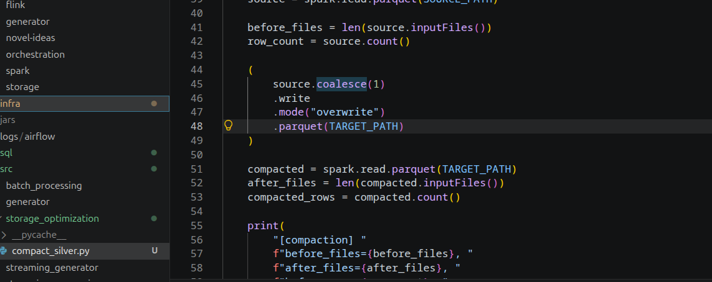
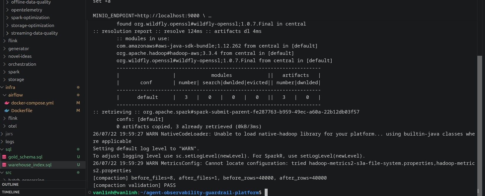
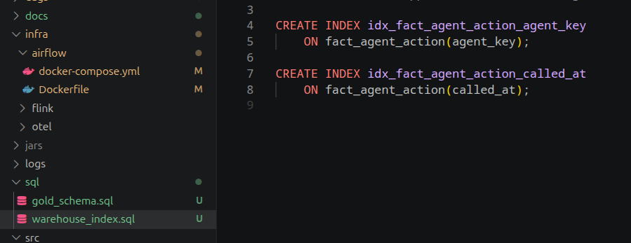
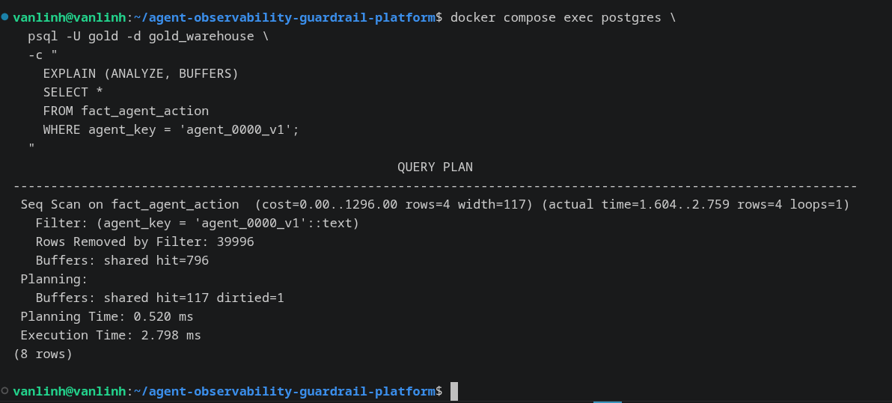
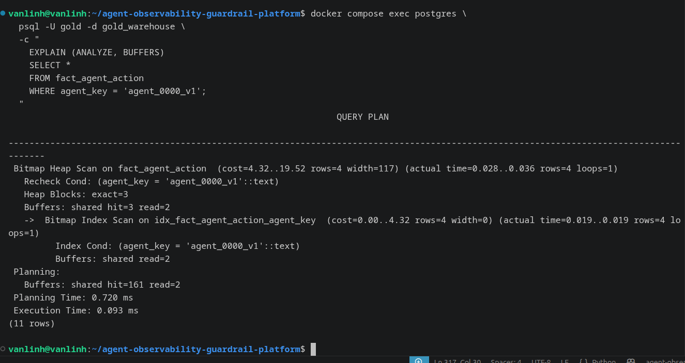

# Storage Optimization

This document covers the two storage optimization requirements: Lakehouse compaction and Data Warehouse indexing.

- Lakehouse file compaction on MinIO.
- PostgreSQL Gold Warehouse indexing with before-and-after execution
  plans.

## Lakehouse Compaction

The optimized Spark batch job writes the Silver action dataset to:

```text
s3://lakehouse/silver/stg_agent_actions/
```

The optimized Spark job uses:

```python
bucketBy(8, "action_id")
```

to avoid the high-cardinality anti-pattern of creating one partition
directory for every nearly unique `action_id`. The resulting Silver
dataset contains eight Parquet data files.

Bucketing and compaction address different storage concerns:

- Bucketing controls the physical distribution and file count of a
  high-cardinality dataset.
- Compaction combines existing files into fewer, larger files to reduce
  metadata operations and file-opening overhead.

The compaction implementation is located at:

```text
src/storage_optimization/compact_silver.py
```

It reads the eight Silver Parquet files and rewrites them using:

```python
source.coalesce(1).write.mode("overwrite").parquet(TARGET_PATH)
```

The compacted output is stored separately at:

```text
s3://lakehouse/silver/compacted/stg_agent_actions/
```

Keeping the compacted output under a separate prefix preserves the
original bucketed Silver dataset for comparison.



### Compaction Result



The measured result was:

| Metric | Before | After |
|---|---:|---:|
| Parquet data files | 8 | 1 |
| Rows | 40,000 | 40,000 |

The validation completed with:

```text
[compaction validation] PASS
```

The unchanged row count confirms that compaction changed only the
physical file layout. It did not remove or duplicate records.

## Data Warehouse Indexing

The PostgreSQL Gold Warehouse contains the action fact table:

```text
fact_agent_action
```

DP3 commonly filters this table by agent and event time. Two B-tree
indexes were therefore added in:

```text
sql/warehouse_index.sql
```

```sql
CREATE INDEX idx_fact_agent_action_agent_key
    ON fact_agent_action(agent_key);

CREATE INDEX idx_fact_agent_action_called_at
    ON fact_agent_action(called_at);
```

The `agent_key` index supports selective per-agent queries. The
`called_at` index supports time-range filtering, including the trailing
seven-day window used by the offline feature pipeline.



## Index Benchmark

The same query was executed before and after creating the indexes:

```sql
SELECT *
FROM fact_agent_action
WHERE agent_key = 'agent_0000_v1';
```

The selected agent version has four matching fact rows, making this a
highly selective query.

### Before Indexing



Before the `agent_key` index existed, PostgreSQL used:

```text
Seq Scan on fact_agent_action
```

Observed result:

```text
Rows returned:            4
Rows removed by filter:   39,996
Shared buffers hit:       796
Execution time:           2.798 ms
```

PostgreSQL scanned the entire 40,000-row fact table and discarded
39,996 rows to return the four matching records.

### After Indexing



After creating the index and running `ANALYZE`, PostgreSQL used:

```text
Bitmap Index Scan on idx_fact_agent_action_agent_key
Bitmap Heap Scan on fact_agent_action
```

Observed result:

```text
Rows returned:      4
Heap blocks:        3
Execution time:     0.093 ms
```

For this local 40,000-row benchmark, execution time improved from
2.798 ms to 0.093 ms:

```text
2.798 / 0.093 ≈ 30.1
```

The indexed query was therefore approximately 30 times faster in this
specific local test. This result demonstrates the change in execution
strategy and should not be interpreted as a universal performance
ratio for every dataset or environment.

## SCD2 Data Alignment Note

During the first DP2 Silver-to-Gold run, 826 actions did not fall within
any existing `dim_agent` SCD Type 2 validity interval.

The action history and agent dimension history were generated
independently, so several actions occurred before the earliest
`valid_from_ts` recorded for their agents.

DP2 resolves this by backdating only the earliest SCD2 version for each
affected agent to that agent's earliest observed action timestamp. Six
earliest dimension versions required this adjustment.

This ensures that:

- Every fact row maps to exactly one `agent_key`.
- Foreign-key constraints remain valid.
- Point-in-time SCD2 mapping remains deterministic.
- Later SCD2 version boundaries remain unchanged.

The alignment is applied only while building the Gold dimension. The
original Bronze and Silver datasets remain unchanged.
